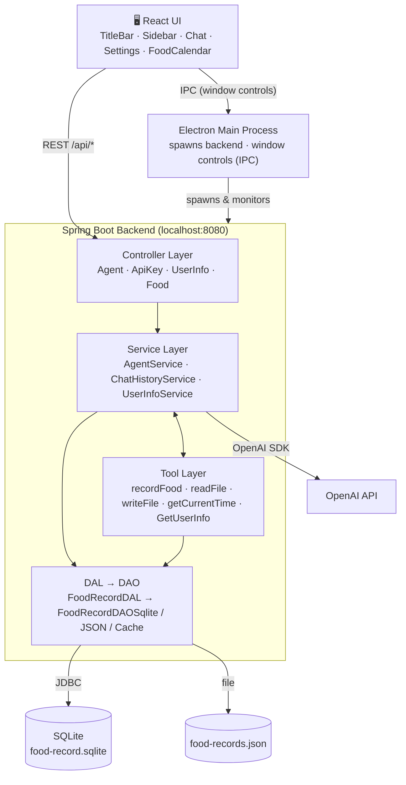

# Tyler Agent

> A personal AI assistant with a desktop UI that remembers your conversations and tracks what you eat.

**Version:** V0.2.0 · **Commit:** `61cc1ca`

---

## What is Tyler?

Tyler is not just a chatbot — it is an AI agent that can *do things*. When you tell it something, it can decide to call a tool behind the scenes: read or write a file in a safe sandbox, remember who you are, or turn what you ate into a persistent record in a real database.

It ships as a desktop app (Electron) with a hand-drawn title bar, a side navigation, a dedicated settings page, and a collapsible food calendar. V0.1.0 looked like a web form; V0.2.0 already has the skeleton of a desktop product.

---

## What can Tyler do now?

1. **Remember conversations across restarts.** Chat history is persisted, restored on startup, and fed back to the model as context. History length is configurable, and you can clear it anytime.

2. **Record food in a database.** `recordFood` saves the food you describe through a Tool → DAL → DAO → SQLite pipeline.

3. **Query and delete food records.** REST APIs let the UI list food by date, delete one record by its stable ID, or delete all records for a day.

4. **A desktop food calendar.** Pick a date, see what you ate, view nutrition information, and confirm deletions in an application dialog.

5. **Sandboxed file access.** File reads and writes stay inside a dedicated workspace folder.

6. **Save your profile and API key.** The settings page stores your profile and OpenAI API key locally. The key authenticates requests to OpenAI; profile information can be sent to the model when a tool reads it.

---

## Architecture



### How a chat message flows

1. The React UI sends the message to `AgentController`.
2. `AgentService` loads recent history through `ChatHistoryService`, appends the new message, and asks OpenAI for a response.
3. If OpenAI decides to use a tool (for example `recordFood`), `AgentService` invokes it, the tool does its real side effect, and the result is fed back to the model.
4. The final reply is returned to the UI, and the conversation is persisted for the next run.

---

### The food-record chain

```
User describes food
  → Agent chooses recordFood
  → RecordFoodTool parses and validates the input
  → FoodRecordDAL
  → FoodRecordDAOSqlite
  → food-record.sqlite
```

The SQLite implementation auto-creates the table and a date index, uses parameterized SQL, preserves `BigDecimal` precision, validates strictly before writing, and maps SQL errors uniformly. The DB path is configurable.

---

## Tech Stack

| Layer | Technology |
|---|---|
| Backend | Java 26 · Spring Boot 4.1.1 · OpenAI Java SDK (openai-java 4.54.0) · SQLite (JDBC) |
| Frontend | React · TypeScript · Vite · Electron |
| Build | Maven (backend) · npm (frontend) |
| Desktop | Electron Forge · Squirrel (Windows installer) |

---

## Project Structure

```
tyler_agent/
├─ src/main/java/org/tyler/
│  ├─ TylerAgentApplication.java   # Spring Boot entry point
│  ├─ config/                     # Application configuration and desktop CORS
│  ├─ controller/                 # HTTP endpoints grouped by feature
│  ├─ service/                    # Chat, history, profile, API key, and workout services
│  ├─ tool/                       # Tools available to the AI
│  ├─ dal/                        # Data access operations
│  ├─ dao/                        # SQLite, JSON, and cache implementations
│  ├─ filesandbox/                # Sandboxed file access
│  ├─ model/                      # Chat, food, user profile, and workout records
│  ├─ filter/                     # Request tracking
│  └─ exceptionHandler/           # Maps exceptions to HTTP responses
├─ src/main/resources/
│  ├─ application.yml             # Model, port, paths, and history configuration
│  ├─ logback-spring.xml           # Console and rotating file logging
│  └─ db/                         # Food and workout SQL scripts
├─ frontend/
│  ├─ electron/                   # Electron main process and preload bridge
│  └─ src/
│     ├─ components/              # Title bar, navigation, chat, settings, and calendar
│     ├─ styles/                  # Design tokens, theme, layout, and chat styles
│     ├─ api.ts                   # Backend API client
│     ├─ App.tsx                  # Application shell and view switching
│     └─ types.ts                 # Frontend data contracts
├─ resources/runtime/             # Bundled JRE (Temurin 26)
├─ pom.xml
└─ README.md
```

---

## Backend Packages

| Package | Responsibility |
|---|---|
| `controller` | Accepts HTTP requests and delegates to services or the DAL. |
| `service` | Runs the chat loop, manages history, profiles, API keys and workouts, and reuses the OpenAI client. |
| `tool` | Provides file access, time, profile lookup, and food recording tools for the AI. |
| `dal` | Exposes application data operations through DAO interfaces. |
| `dao` | Implements SQLite persistence for food and workouts, plus legacy JSON and cache implementations for food. |
| `filesandbox` | Resolves file paths within the workspace and rejects paths outside it. |
| `model` | Defines food, workout, profile, and chat data records. |
| `filter` | Assigns a request ID for tracing. |
| `exceptionHandler` | Maps application exceptions to consistent HTTP error responses. |

---

## Frontend Structure

```
Application
├─ TitleBar: logo, title, minimize, maximize, close
├─ Sidebar: Chat / Settings
└─ Main
   ├─ Chat: messages and collapsible food calendar
   └─ Settings: user profile and API key forms
```

The title bar is hand-drawn (`frame: false`) with a `preload.cjs` bridge and IPC for minimize / maximize / close. The title area is draggable; the button area is `no-drag`. The food calendar lives inside the chat page as a collapsible sidebar, and userinfo + API key are collected on a dedicated settings page.

CSS is split into four files under `frontend/src/styles/`:

| File | Responsibility |
|---|---|
| `tokens.css` | Colors, radii, spacing, shadows, fonts, and layout dimensions. |
| `theme.css` | Resets, base elements, cards, and component styles. |
| `layout.css` | Title bar, sidebar, navigation, settings, and collapsible panels. |
| `chat.css` | Message bubbles, message list, and composer styles. |

---

## Tools Tyler Can Call

| Tool | Purpose |
|---|---|
| `getCurrentTime` | Returns the current date and time. |
| `GetUserInfo` | Reads your saved profile. |
| `readFile` | Reads a file in the sandbox. |
| `writeFile` | Writes a text file in the sandbox, creating parent directories as needed. |
| `recordFood` | Parses food information and persists it to SQLite. |

---

## How to Run

### Prerequisites

- Backend: JDK 26, Maven
- Frontend: Node.js (v18+)

> **No environment variable needed.** Set your OpenAI API key from the settings page. It is stored locally in a sandbox file (`apikey.txt`) and used to authenticate requests to OpenAI. The backend can start without a key; a key is required for chat.

### Backend

```bash
mvn spring-boot:run
# listens on http://localhost:8080
```

### Frontend (development)

```bash
cd frontend
npm install
npm run dev
# listens on http://localhost:5173; /api requests are proxied to 8080
```

Open http://localhost:5173. First, paste your OpenAI API key into the settings page and save it, then start chatting.

### Desktop app (Electron)

```bash
# 1. build the backend JAR (once)
mvn clean package

# 2. build the React production bundle
cd frontend
npm install
npm run build

# 3. launch the desktop app (starts backend + opens window)
npm run electron
```

Electron's main process locates a Java runtime (prefers the bundled JRE under `resources/runtime/`, then falls back to `JAVA_HOME` → `~/.jdks` → `PATH`), spawns the backend JAR, waits until it is ready, then opens the window. Closing the window also shuts the backend down.

### Windows installer (Squirrel)

```bash
cd frontend
npm run make
```

Artifacts land in `frontend/out/make/squirrel.windows/x64/` (a `Setup.exe` plus the Squirrel package). The installer is unsigned in alpha, so SmartScreen may show an "unknown publisher" warning.

---

## Configuration (`application.yml`)

| Setting | Environment variable | Default | Description |
|---|---|---|---|
| `openai.model` | — | `gpt-5.6` | OpenAI model used for chat. |
| `openai.key-file-path` | `OPENAI_KEY_FILE_PATH` | `apikey.txt` | Sandbox path for the API key. |
| `agent.workspace-dir` | `AGENT_WORKSPACE_DIR` | *(empty)* | Sandbox folder; an empty value uses the default location. |
| `userinfo.file-path` | `USERINFO_FILE_PATH` | `userinfo.json` | Profile JSON path. |
| `chat.history-file-path` | `CHAT_HISTORY_FILE_PATH` | `chat-history.json` | Chat history file path. |
| `chat.max-messages` | `CHAT_MAX_MESSAGES` | `20` | Maximum number of retained messages. |
| `food.database-path` | `FOOD_DATABASE_PATH` | `food-record.sqlite` | Food SQLite database path. |
| `food.file-path` | `FOOD_FILE_PATH` | `food-records.json` | Legacy food JSON file path. |

---

## V0.2.0 Release Notes

V0.2.0 adds roughly **3,986 lines** across **71 changed files** compared to V0.1.0. It delivers complete chat history, a full food-persistence pipeline, and a significant desktop UI overhaul.

### 1. Conversations persist across restarts

New: `ChatMessage`, `ChatHistoryService`, `GET /api/agent/history`, `DELETE /api/agent/history`, history restore on startup, history fed back to the model as context, configurable history length, a clear-chat feature, and input disabled while history is loading to avoid async overwrites. Tyler no longer "forgets" after a restart.

### 2. Food records persist in SQLite

The core change of V0.2.0:

```
User describes food
  → Agent chooses recordFood
  → RecordFoodTool parses and validates the input
  → FoodRecordDAL
  → FoodRecordDAOSqlite
  → food-record.sqlite
```

`recordFood` has grown from a "parser" into a tool that produces real side effects. The SQLite implementation includes auto table creation, auto date indexing, parameterized SQL, `BigDecimal` precision preservation, strict pre-write validation, a configurable DB path, uniform SQL error handling, and real SQLite temp-database tests.

### 3. Food records have stable IDs

New: `FoodRecord`, `FoodEntry`, SQLite auto-increment primary key, `createdAt`. This removes the old reliance on full `Food.equals()` for deletion; records can now be deleted with `DELETE FROM food_record WHERE id = ?`, which no longer fails when the model re-estimates a different calorie count.

### 4. Food query and delete APIs

New REST capabilities: query food records by date, delete a single record by ID, and delete all records for a day. The frontend no longer has to go through chat to inspect data.

### 5. Food calendar

New `FoodCalendar`: pick a date, see that day's food, view nutrition info, delete a single record, delete a whole day, confirm before deleting, and refresh after changes. Users no longer have to ask the agent "what did I eat today".

### 6. Frontend overhaul

V0.2.0 adds: a hand-drawn desktop title bar, minimize / maximize / close buttons, a left side navigation, a chat page, a settings page, a collapsible food calendar, a delete confirmation dialog, CSS tokens, separated layout/theme/chat styles, and an Electron preload bridge. V0.1.0 looked like a web form; V0.2.0 already has the structure of a desktop product.

### 7. Wider test coverage

New or strengthened: `ChatHistoryServiceTest`, `FoodRecordDAOTest`, `FoodRecordDAOCacheTest`, `FoodRecordDAOSqliteTest`, `FoodRecordDALTest`, `FoodControllerTest`, `SqlExceptionHandlerTest`, `RecordFoodToolTest`. Coverage has grown from scattered class tests to full chains: Tool → DAL → DAO → SQLite, and Controller → DAL.
