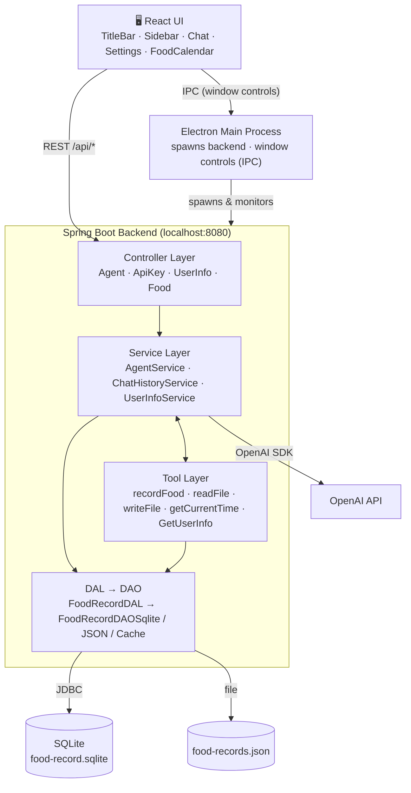

# Tyler Agent

> A personal AI assistant with a desktop UI that remembers your conversations and tracks what you eat.
> 一个带桌面界面的个人 AI 助手，能记住你们的对话，也能记录你吃了什么。

**Version:** V0.2.0 · **Commit:** `61cc1ca`

---

## What is Tyler? · Tyler 是什么

Tyler is not just a chatbot — it is an AI agent that can *do things*. When you tell it something, it can decide to call a tool behind the scenes: read or write a file in a safe sandbox, remember who you are, or turn what you ate into a persistent record in a real database.

Tyler 不只是一个聊天机器人——它是一个能真正「动手做事」的 AI Agent。当你对它说话时，它会在背后决定调用某个工具：在安全的沙盒里读写文件、记住你是谁，或者把你吃的东西写进真正的数据库，成为一条持久记录。

It ships as a desktop app (Electron) with a hand-drawn title bar, a side navigation, a dedicated settings page, and a collapsible food calendar. V0.1.0 looked like a web form; V0.2.0 already has the skeleton of a desktop product.

它以桌面应用（Electron）形态呈现，带自绘标题栏、左侧导航、独立的设置页和可收起的饮食日历。V0.1.0 看起来还像一张网页表单，V0.2.0 已经开始具备桌面产品的骨架。

---

## What can Tyler do now? · 现在能做什么

1. **Remember conversations across restarts · 对话真正具备连续性。** Chat history is persisted, restored on startup, and fed back to the model as context. Tyler no longer "forgets" who you are when it restarts. History length is configurable, and you can clear it anytime.

   聊天历史会被持久化，前端启动时恢复，并作为上下文重新发送给模型。Tyler 重启后不再「失忆」。历史长度可配置，也可随时清空。

2. **Record food into a real database · 食物记录真正落盘。** `recordFood` is no longer just a parser — it produces a real side effect. What you describe ends up in a SQLite database through a full Tool → DAL → DAO → SQLite chain.

   `recordFood` 不再只是一个解析器，而是真正产生副作用的 Tool。你描述的食物会经过 Tool → DAL → DAO → SQLite 一整条链路，最终写进数据库。

3. **Query and delete food records · 饮食查询与删除。** REST APIs let the UI list food by date, delete one record by its stable ID, or delete a whole day — no longer only through chat.

   REST API 让前端可以按日期查询食物、按稳定 ID 删除单条、或删除某一天全部记录——不再只能通过聊天查看。

4. **A desktop food calendar · 饮食日历。** Pick a date, see what you ate, view nutrition info, and delete with a confirmation dialog that no longer steals window focus.

   选一个日期，就能看到当天吃了什么、营养信息，删除前有确认弹窗，而且不再「偷走」窗口焦点。

5. **Safe sandbox file IO · 安全的沙盒读写。** All file reads and writes stay inside one fenced-off folder, so the rest of your computer is untouched.

   所有文件读写都被限制在一个专属文件夹（沙盒）里，电脑其余部分不受影响。

6. **Save your profile and API key · 保存个人资料与密钥。** A settings page collects your basic profile and OpenAI API key, stored locally and never sent anywhere else.

   设置页收集你的基本资料和 OpenAI API Key，全部保存在本地，不会外发。

---

## Architecture · 架构



### How a chat message flows · 一条消息如何流动

1. The React UI sends the message to `AgentController`.
2. `AgentService` loads recent history through `ChatHistoryService`, appends the new message, and asks OpenAI for a response.
3. If OpenAI decides to use a tool (for example `recordFood`), `AgentService` invokes it, the tool does its real side effect, and the result is fed back to the model.
4. The final reply is returned to the UI, and the conversation is persisted for the next run.

---

1. React 前端把消息发给 `AgentController`。
2. `AgentService` 通过 `ChatHistoryService` 加载近期历史，追加新消息，再向 OpenAI 请求回复。
3. 若 OpenAI 决定调用工具（例如 `recordFood`），`AgentService` 会执行它，工具产生真实副作用，结果回传模型。
4. 最终回复返回前端，整段对话被持久化，供下一次运行使用。

### The food-record chain · 食物记录链路

```
用户描述食物
  → Agent 选择 recordFood
  → RecordFoodTool 解析并校验
  → FoodRecordDAL
  → FoodRecordDAOSqlite
  → food-record.sqlite
```

The SQLite implementation auto-creates the table and a date index, uses parameterized SQL, preserves `BigDecimal` precision, validates strictly before writing, and maps SQL errors uniformly. The DB path is configurable.

SQLite 实现会自动建表、自动创建日期索引，使用参数化 SQL，保留 `BigDecimal` 精度，写入前严格校验，SQL 异常统一处理，数据库路径可配置。


---

## Tech Stack · 技术栈

| Layer · 层 | Technology · 技术 |
|---|---|
| Backend · 后端 | Java 26 · Spring Boot 4.1.1 · OpenAI Java SDK (openai-java 4.54.0) · SQLite (JDBC) |
| Frontend · 前端 | React · TypeScript · Vite · Electron |
| Build · 构建 | Maven (backend) · npm (frontend) |
| Desktop · 桌面 | Electron Forge · Squirrel (Windows installer) |

---

## Project Structure · 项目结构

```
tyler_agent/
├─ src/main/java/org/tyler/
│  ├─ TylerAgentApplication.java   # Spring Boot 入口 / entry point
│  ├─ config/                      # 应用级配置（桌面端 CORS）/ app configuration
│  ├─ controller/                  # HTTP 层：接收前端请求 / HTTP layer
│  ├─ service/                     # 业务逻辑：聊天循环 + 历史 + 用户资料 + API Key / business logic
│  ├─ tool/                        # AI 可调用的工具 / tools the AI can call
│  ├─ dal/                         # 数据访问层：编排 DAO / data-access layer
│  ├─ dao/                         # 数据访问对象：SQLite / JSON / Cache 实现 / DAO implementations
│  ├─ filesandbox/                 # 安全的沙盒文件 IO / sandboxed file IO
│  ├─ model/                       # 数据记录：chat / food / userInfo / plain data records
│  ├─ filter/                      # 请求追踪（requestId）/ request tracking
│  └─ exceptionHandler/            # 异常 → 干净的 HTTP 响应 / error mapping
├─ src/main/resources/
│  ├─ application.yml              # 配置（模型、端口、路径、历史长度……）/ configuration
│  ├─ logback-spring.xml           # 日志（控制台 + 滚动文件）/ logging
│  └─ db/food_record/              # 食物记录的 SQL 脚本 / SQL scripts
├─ frontend/
│  ├─ electron/                    # Electron 主进程 + preload 桥接 / main + preload
│  └─ src/
│     ├─ components/               # 标题栏、侧边栏、聊天、设置、日历等 / UI components
│     ├─ styles/                   # tokens / theme / layout / chat 四件套 / CSS split
│     ├─ api.ts                    # 后端 API 调用封装 / API client
│     ├─ App.tsx                   # 应用骨架 + 页面切换 / app shell
│     └─ types.ts                  # 前端类型定义 / TypeScript types
├─ resources/runtime/              # 内置 JRE（Temurin 26），用户无需装 Java / bundled JRE
├─ pom.xml
└─ README.md
```

---

## Backend Packages · 后端包职责

| Package · 包 | What it does · 职责 |
|---|---|
| `controller` | 接收 HTTP 请求并转发，不做实际业务 / The front door for web requests. |
| `service` | 大脑：聊天循环、决定调用工具、管理历史/资料/密钥、复用 OpenAI client / The brain. |
| `tool` | 工具箱：AI 可选的每个小能力（读文件、写文件、取时间、读资料、记食物）/ The toolbox. |
| `dal` | 数据访问层：编排底层 DAO，暴露业务语义（按日期读、按 ID 删）/ Orchestrates DAOs into business operations. |
| `dao` | 数据访问对象：`FoodRecordDAOSqlite`（主实现）、JSON、Cache / The persistence implementations. |
| `filesandbox` | 沙盒文件区：所有读写都经它，拒绝触碰沙盒外 / Fenced-off file area. |
| `model` | 纯数据记录：食物、用户信息、聊天消息 / Plain data records. |
| `filter` | 请求追踪：给每个请求打 requestId / Request tracking. |
| `exceptionHandler` | 异常清理：把错误转成整洁的 HTTP 响应 / Turns errors into clean responses. |

---

## Frontend Structure · 前端结构

```
┌ TitleBar（自绘：logo + 标题 + 最小化/最大化/关闭）──────────┐
├─────────┬──────────────────────────────────────────────┤
│ Sidebar │ Main（view 切换）                              │
│  聊天    │ ├ 聊天页(默认)：消息区主体 + 日历侧栏(可收起)  │
│  设置    │ └ 设置页：UserInfoForm + ApiKeyForm            │
└─────────┴──────────────────────────────────────────────┘
```

The title bar is hand-drawn (`frame: false`) with a `preload.cjs` bridge and IPC for minimize / maximize / close. The title area is draggable; the button area is `no-drag`. The food calendar lives inside the chat page as a collapsible sidebar, and userinfo + API key are collected on a dedicated settings page.

标题栏是自绘的（`frame: false`），通过 `preload.cjs` 桥接 + IPC 实现最小化/最大化/关闭。标题文字区可拖拽，按钮区 `no-drag`。饮食日历作为聊天页内可收起侧栏，userinfo 与 API Key 收在独立设置页。

CSS is split into four files under `frontend/src/styles/`:

CSS 被拆成 `frontend/src/styles/` 下的四个文件：

| File · 文件 | Responsibility · 职责 |
|---|---|
| `tokens.css` | 全部变量：颜色 + 圆角/间距/阴影/字体 + 骨架尺寸 / design tokens |
| `theme.css` | reset、基础元素、卡片与组件样式 / reset + component styles |
| `layout.css` | 标题栏、侧边栏、主区、导航、设置页、可收起侧栏 / layout |
| `chat.css` | 聊天气泡、消息列表、输入区 / chat-specific styles |

---

## Tools Tyler Can Call · 可调用的工具

| Tool · 工具 | What it does · 作用 |
|---|---|
| `getCurrentTime` | 返回当前日期和时间 / Returns the current date and time. |
| `GetUserInfo` | 读取已保存的资料 / Reads your saved profile. |
| `readFile` | 读取沙盒内的文件 / Reads a file in the sandbox. |
| `writeFile` | 向沙盒写文本文件（自动建目录）/ Writes a text file in the sandbox. |
| `recordFood` | 解析食物描述并落盘到 SQLite（真正副作用）/ Parses food and persists it to SQLite. |


---

## How to Run · 运行方式

### Prerequisites · 前置条件

- Backend: JDK 26, Maven
- Frontend: Node.js (v18+)

> **No environment variable needed.** You set your OpenAI API key from the UI — it is stored in a sandbox file (`apikey.txt`) and never leaves your machine. The backend starts fine without a key; you only need one when you actually start chatting.

> **无需环境变量。** 你在界面上设置 OpenAI API Key——它存在沙盒文件（`apikey.txt`）里，不会离开你的机器。没有 Key 后端也能正常启动，只有真正开始聊天时才需要。

### Backend · 后端

```bash
mvn spring-boot:run
# listens on http://localhost:8080
```

### Frontend (development) · 前端（开发）

```bash
cd frontend
npm install
npm run dev
# listens on http://localhost:5173; /api requests are proxied to 8080
```

Open http://localhost:5173. First, paste your OpenAI API key into the settings page and save it, then start chatting.

打开 http://localhost:5173。先在设置页粘贴 OpenAI API Key 并保存，然后开始聊天。

### Desktop app (Electron) · 桌面应用

```bash
# 1. build the backend JAR (once)
mvn clean package

# 2. build the React production bundle
cd frontend
npm install
npm run build

# 3. launch the desktop app (starts backend + opens window)
npm run electron
```

Electron's main process locates a Java runtime (prefers the bundled JRE under `resources/runtime/`, then falls back to `JAVA_HOME` → `~/.jdks` → `PATH`), spawns the backend JAR, waits until it is ready, then opens the window. Closing the window also shuts the backend down.

Electron 主进程会定位 Java 运行时（优先内置 JRE `resources/runtime/`，再回退到 `JAVA_HOME` → `~/.jdks` → `PATH`），启动后端 JAR，等待就绪后打开窗口；关闭窗口时也会一并关闭后端。

### Windows installer (Squirrel) · Windows 安装包

```bash
cd frontend
npm run make
```

Artifacts land in `frontend/out/make/squirrel.windows/x64/` (a `Setup.exe` plus the Squirrel package). The installer is unsigned in alpha, so SmartScreen may show an "unknown publisher" warning.

产物在 `frontend/out/make/squirrel.windows/x64/`（一个 `Setup.exe` 加 Squirrel 包）。alpha 阶段安装包未签名，SmartScreen 可能弹出「未知发布者」警告。

---

## Configuration (`application.yml`) · 配置

| Setting · 配置项 | Environment variable · 环境变量 | Default · 默认值 | Description · 说明 |
|---|---|---|---|
| `openai.model` | — | `gpt-5.6` | 使用的 OpenAI 模型 / The OpenAI model |
| `openai.key-file-path` | `OPENAI_KEY_FILE_PATH` | `apikey.txt` | API Key 的沙箱内路径 / sandbox path for the API key |
| `agent.workspace-dir` | `AGENT_WORKSPACE_DIR` | *(empty)* | 沙盒文件夹 / the sandbox folder |
| `userinfo.file-path` | `USERINFO_FILE_PATH` | `userinfo.json` | 用户资料 JSON 路径 / profile JSON path |
| `chat.history-file-path` | `CHAT_HISTORY_FILE_PATH` | `chat-history.json` | 聊天历史文件路径 / chat history file path |
| `chat.max-messages` | `CHAT_MAX_MESSAGES` | `20` | 历史最多保留的消息条数 / max history size |
| `food.database-path` | `FOOD_DATABASE_PATH` | `food-record.sqlite` | 食物记录 SQLite 数据库路径 / SQLite DB path |
| `food.file-path` | `FOOD_FILE_PATH` | `food-records.json` | 食物记录 JSON 路径（历史兼容）/ JSON path (legacy) |

---

## V0.2.0 Release Notes · V0.2.0 更新总结

V0.2.0 adds roughly **3,986 lines** across **71 changed files** compared to V0.1.0. It delivers complete chat history, a full food-persistence pipeline, and a significant desktop UI overhaul.

V0.2.0 相比 V0.1.0 增加约 **3,986 行**、**71 个变更文件**，带来了完整的聊天历史、完整的食物持久化链路，以及一轮显著的桌面界面重构。

### 1. Conversations are truly continuous · 对话真正具备连续性

New: `ChatMessage`, `ChatHistoryService`, `GET /api/agent/history`, `DELETE /api/agent/history`, history restore on startup, history fed back to the model as context, configurable history length, a clear-chat feature, and input disabled while history is loading to avoid async overwrites. Tyler no longer "forgets" after a restart.

新增：`ChatMessage`、`ChatHistoryService`、`GET /api/agent/history`、`DELETE /api/agent/history`、前端启动时恢复聊天记录、对话历史重新作为上下文发送给模型、历史长度可配置、清空对话功能、历史读取期间禁用输入避免异步覆盖。这意味着 Tyler 重启后不再「失忆」。

### 2. Food records truly persist · 食物记录真正落盘

The core change of V0.2.0:

V0.2.0 最核心的变化：

```
用户描述食物
  → Agent 选择 recordFood
  → RecordFoodTool 解析和校验
  → FoodRecordDAL
  → FoodRecordDAOSqlite
  → food-record.sqlite
```

`recordFood` has grown from a "parser" into a tool that produces real side effects. The SQLite implementation includes auto table creation, auto date indexing, parameterized SQL, `BigDecimal` precision preservation, strict pre-write validation, a configurable DB path, uniform SQL error handling, and real SQLite temp-database tests.

`recordFood` 已经从「解析器」变成真正产生副作用的 Tool。SQLite 实现包括：自动建表、自动创建日期索引、参数化 SQL、`BigDecimal` 精度保留、数据写入前严格校验、数据库路径可配置、SQL 异常统一处理、真实 SQLite 临时数据库测试。

### 3. Food records have stable IDs · 食物记录有了稳定 ID

New: `FoodRecord`, `FoodEntry`, SQLite auto-increment primary key, `createdAt`. This removes the old reliance on full `Food.equals()` for deletion; records can now be deleted with `DELETE FROM food_record WHERE id = ?`, which no longer fails when the model re-estimates a different calorie count.

新增：`FoodRecord`、`FoodEntry`、SQLite 自增主键、`createdAt`。这解决了早期依赖完整 `Food.equals()` 删除的问题，现在可以 `DELETE FROM food_record WHERE id = ?`，不会因为模型重新估算的卡路里不同而删除失败。

### 4. Food query and delete APIs · 饮食查询和删除 API

New REST capabilities: query food records by date, delete a single record by ID, and delete all records for a day. The frontend no longer has to go through chat to inspect data.

新增的 REST 能力：按日期查询食物记录、按 ID 删除单条记录、删除某一天全部记录。这让前端不再只能通过聊天查看数据。

### 5. Food calendar · 饮食日历

New `FoodCalendar`: pick a date, see that day's food, view nutrition info, delete a single record, delete a whole day, confirm before deleting, and refresh after changes. Users no longer have to ask the agent "what did I eat today".

新增 `FoodCalendar`：选择日期、查看当天食物、显示营养信息、删除单条记录、删除整天记录、删除前确认、记录变化后刷新。用户不再必须问 Agent「我今天吃了什么」，也可以直接查看确定的数据。

### 6. Frontend overhaul · 前端整体重构

V0.2.0 adds: a hand-drawn desktop title bar, minimize / maximize / close buttons, a left side navigation, a chat page, a settings page, a collapsible food calendar, a delete confirmation dialog, CSS tokens, separated layout/theme/chat styles, and an Electron preload bridge. V0.1.0 looked like a web form; V0.2.0 already has the structure of a desktop product.

V0.2.0 增加：自绘桌面标题栏、最小化/最大化/关闭按钮、左侧导航栏、聊天页面、设置页面、可收起的饮食日历、删除确认弹窗、CSS Tokens、Layout/Theme/Chat 分离、Electron preload 桥接。V0.1.0 像一张网页表单，V0.2.0 已经开始呈现桌面产品的结构。

### 7. Wider test coverage · 测试覆盖扩大

New or strengthened: `ChatHistoryServiceTest`, `FoodRecordDAOTest`, `FoodRecordDAOCacheTest`, `FoodRecordDAOSqliteTest`, `FoodRecordDALTest`, `FoodControllerTest`, `SqlExceptionHandlerTest`, `RecordFoodToolTest`. Coverage has grown from scattered class tests to full chains: Tool → DAL → DAO → SQLite, and Controller → DAL.

新增或强化：`ChatHistoryServiceTest`、`FoodRecordDAOTest`、`FoodRecordDAOCacheTest`、`FoodRecordDAOSqliteTest`、`FoodRecordDALTest`、`FoodControllerTest`、`SqlExceptionHandlerTest`、`RecordFoodToolTest`。覆盖范围已从零散类测试扩展到完整链路：Tool → DAL → DAO → SQLite，以及 Controller → DAL。

