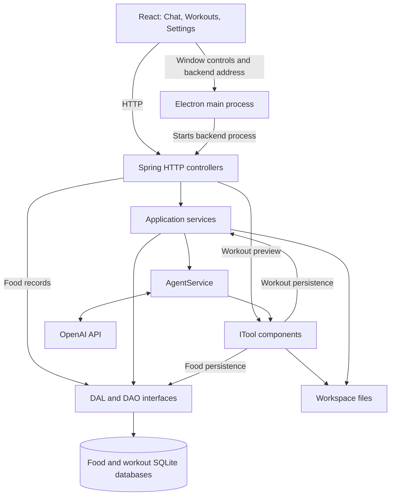

# Tyler Agent developer guide

[Back to the user guide](../README.md)

This page covers building, running, and maintaining Tyler. For the everyday app workflow, start with the [README](../README.md).

For backend implementation and review conventions, see the [backend coding and design standards](BACKEND_STANDARDS.md).

## Contents

- [Run from source](#run-from-source)
- [Architecture](#architecture)
- [Repository layout](#repository-layout)
- [Agent tools and workout persistence](#agent-tools-and-workout-persistence)
- [HTTP API](#http-api)
- [Configuration and data storage](#configuration-and-data-storage)
- [Networking and desktop startup](#networking-and-desktop-startup)
- [Testing](#testing)
- [Release version and packaging](#release-version-and-packaging)
- [Troubleshooting](#troubleshooting)

## Run from source

The desktop launcher and installer configuration target Windows. Build requirements are:

| Requirement | Repository setting |
|---|---|
| JDK | Java 26, configured in [pom.xml](../pom.xml). |
| Maven | Used to compile, test, and package the backend. |
| Node.js and npm | Node.js 22.12.0 or newer, required by the Electron dependency in [package-lock.json](../frontend/package-lock.json). |
| OpenAI API key | Required for chat; enter it in the app's Settings page. |

### Browser development

From the repository root:

```powershell
mvn package
cd frontend
npm ci
npm run dev
```

Open the Vite address printed in the terminal. The development command starts the backend JAR and Vite together, then connects the frontend proxy to that backend's assigned port. Rebuild the JAR and restart this command after backend changes; Vite reloads frontend source changes during development.

To preview the built frontend, run these commands from `frontend/`:

```powershell
npm run build
npm run preview
```

The preview command also starts its own backend process.

### Desktop development

From the repository root:

```powershell
mvn package
cd frontend
npm ci
npm run build
npm run electron
```

Electron loads the built frontend and starts the backend automatically. Rebuild the frontend after changing its source before launching Electron again. Closing the application terminates its backend child process.

### Backend only

From the repository root:

```powershell
mvn spring-boot:run
```

The backend uses an available loopback port by default. A saved API key is needed for chat, but the server can start without one. Use the combined development launcher above when working with the browser UI.

## Architecture

| Area | Technologies |
|---|---|
| Backend | Java 26, Spring Boot 4.1.1, OpenAI Java SDK 4.54.0, Spring JDBC, SQLite. |
| Frontend | React 18, TypeScript, Vite, react-calendar. |
| Desktop | Electron, Electron Forge, Squirrel.Windows. |
| Build | Maven and npm. |

Dependency declarations live in [pom.xml](../pom.xml) and [package.json](../frontend/package.json); the frontend lockfile records resolved npm versions.



For a chat request, `AgentService` loads retained history, adds the new message, and calls OpenAI with the registered tool definitions. It executes any requested tools and sends their results back to the model, up to five tool rounds. It then saves the user message and final reply and returns the reply to the frontend.

Controllers and services are grouped by feature. The workout service calls its DAO directly, and the workout plan tool uses the service for persistence. The food controller delegates to the food DAL. SQLite implementations load parameterized SQL from resource files, validate input, and preserve decimal values as strings. SQL read failures use `SQLReadException`; write failures use `SQLPersistentException`. Exception handlers translate these failures into HTTP responses.

## Repository layout

```text
tyler_agent/
├─ .mvn/maven.config               # Shared release version
├─ docs/DEVELOPMENT.md             # This guide
├─ src/main/java/org/tyler/
│  ├─ config/                     # Startup and CORS configuration
│  ├─ controller/                 # HTTP routes grouped by feature
│  ├─ service/                    # Chat, history, settings, and workouts
│  ├─ tool/                       # Agent tools
│  ├─ dal/                        # Food data access contracts and delegation
│  ├─ dao/                        # SQLite persistence and food cache decorator
│  ├─ model/                      # Application data records
│  ├─ filesandbox/                # Workspace file access
│  ├─ filter/                     # Request tracing
│  └─ exceptionHandler/           # HTTP error handling
├─ src/main/resources/
│  ├─ application.yml             # Application defaults
│  ├─ logback-spring.xml           # Logging configuration
│  └─ db/                         # Food and workout SQL files
├─ src/test/java/org/tyler/        # Backend tests
├─ frontend/
│  ├─ electron/                   # Main process, preload bridge, startup tests
│  ├─ scripts/                    # Development and version synchronization
│  ├─ src/components/
│  │  ├─ chat/                   # MessageBubble and MessageInput
│  │  ├─ food/                   # FoodCalendar
│  │  ├─ workout/                # WorkoutPage
│  │  ├─ settings/               # SettingsPage, ApiKeyForm, and UserInfoForm
│  │  ├─ layout/                 # Sidebar and TitleBar
│  │  └─ common/                 # Shared ConfirmDialog
│  ├─ src/styles/                 # Shared theme and page styles
│  ├─ src/api.ts                  # HTTP client
│  ├─ src/types.ts                # Frontend data contracts
│  └─ src/App.tsx                 # Application shell and view state
├─ resources/runtime/             # Local Java runtime for packaging; ignored by Git
└─ pom.xml
```

`App` owns navigation between Chat, Workouts, and Settings. Chat includes the collapsible food calendar. `WorkoutPage` owns date selection, plan previews, and the saved-exercise editor. `api.ts` handles HTTP requests. Electron uses a preload bridge for the backend address and custom window controls, with context isolation enabled and renderer Node integration disabled.

CSS lives in `frontend/src/styles/`: `tokens.css` defines shared design values; `theme.css` supplies base and component styles; `layout.css` arranges the application shell; `chat.css` and `workout.css` style their respective pages.

## Agent tools and workout persistence

Spring discovers components implementing [`ITool`](../src/main/java/org/tyler/tool/ITool.java). `AgentService` receives them as a list and exposes their function definitions to OpenAI.

| Tool | Behavior |
|---|---|
| `getCurrentTime` | Returns the server's current local date and time. |
| `GetUserInfo` | Reads the saved profile. |
| `readFile` | Reads a text file within the workspace. |
| `writeFile` | Writes a text file within the workspace, creating parent directories as needed. |
| `recordFood` | Validates food arguments and saves the record through the food DAL. |
| `generateWorkoutPlan` | Generates seven dated days and saves the planned exercises through the workout service and DAO. |

The workout tool accepts `startDate` in `YYYY-MM-DD` format, `goal` (`general_fitness`, `strength`, or `muscle_gain`), and `equipment` (`bodyweight` or `gym`). Its templates produce strength, cardio, recovery, and rest days.

Executing the tool saves nine strength exercises and three timed activity entries for a new week. Timed activities include their duration in the exercise name and use `1X1` for one session. Rest days have no workout entry. New records use weight `0` as a placeholder. Existing records with the same date and exercise name are reused, preserving their saved reps and weights.

If a write fails, the tool attempts to delete the records inserted during that execution and propagates the failure. This is compensating cleanup across individual writes, not a database transaction; matching by date and name also does not enforce uniqueness across concurrent calls.

The calendar uses the tool's separate `previewPlan` method through `GET /api/workouts/plan`. A preview performs no database writes. **Add to calendar** creates an entry, while **Save exercise** creates or updates a saved entry. The preview week begins on Monday; an agent-generated plan begins on its supplied start date.

## HTTP API

All routes use the running backend's assigned address. JSON errors generally contain an `error` field. Invalid bodies and validation failures return HTTP 400; database failures return HTTP 500.

| Method | Route | Purpose |
|---|---|---|
| POST | `/api/agent/chat` | Send `{ "message": "..." }`; receive `{ "reply": "..." }`. |
| GET | `/api/agent/history` | Read retained conversation history. |
| DELETE | `/api/agent/history` | Clear conversation history. |
| GET / POST | `/api/userinfo` | Read or save the user profile. |
| GET | `/api/apikey/status` | Return whether a key is configured. |
| POST | `/api/apikey` | Save `{ "apiKey": "..." }`; return configuration status. |
| GET | `/api/food?date=YYYY-MM-DD` | List food entries with their database IDs. |
| DELETE | `/api/food/{id}` | Delete one food entry. |
| DELETE | `/api/food/date/{date}` | Delete all food entries for a date. |
| GET | `/api/workouts?date=YYYY-MM-DD` | List saved workout entries for a date. |
| GET | `/api/workouts/plan?startDate=YYYY-MM-DD&goal=general_fitness&equipment=bodyweight` | Preview a seven-day plan without saving it. |
| POST | `/api/workouts` | Save a workout; return its ID and data with HTTP 201. |
| PUT | `/api/workouts/{id}` | Update a workout; return HTTP 404 if it does not exist. |
| DELETE | `/api/workouts/{id}` | Delete a workout; return HTTP 204, or HTTP 404 if missing. |

Workout create and update requests use this shape:

```json
{
  "workoutName": "Squat",
  "rep": "4X12",
  "weight": 20,
  "workoutDate": "2026-10-05"
}
```

Saved workout responses wrap the record as `{ "id": 7, "workout": { ... } }`. Reps require positive sets and repetitions separated by uppercase `X`; weight must be nonnegative and the date must parse as an ISO date. The current model has no weight-unit field.

## Configuration and data storage

Defaults are in [application.yml](../src/main/resources/application.yml). The workspace defaults to `{user.home}/AppData/Local/tyler_agent`; set `AGENT_WORKSPACE_DIR` to choose another directory. Data paths below are relative to that workspace.

| Property | Environment variable | Default |
|---|---|---|
| `server.address` | `SERVER_ADDRESS` | `127.0.0.1` |
| `server.port` | `SERVER_PORT` | `0` (assigned by the OS) |
| `openai.model` | `OPENAI_MODEL` | `gpt-5.6` |
| `openai.key-file-path` | `OPENAI_KEY_FILE_PATH` | `apikey.txt` |
| `agent.workspace-dir` | `AGENT_WORKSPACE_DIR` | Default workspace above |
| `userinfo.file-path` | `USERINFO_FILE_PATH` | `userinfo.json` |
| `chat.history-file-path` | `CHAT_HISTORY_FILE_PATH` | `chat-history.json` |
| `chat.max-messages` | `CHAT_MAX_MESSAGES` | `20` |
| `food.database-path` | `FOOD_DATABASE_PATH` | `food-record.sqlite` |
| `workout.database-path` | `WORKOUT_DATABASE_PATH` | `workout-record.sqlite` |

The workout database default is declared in its DAO constructor. `OPENAI_MODEL` and `WORKOUT_DATABASE_PATH` use Spring's environment property binding. App-managed startup explicitly sets the server address and port, so those two settings apply as overrides only when starting the backend independently.

The API key is stored as a local text file. The key status API returns only whether a key is configured. Conversation requests go to OpenAI and can include recent history, profile details, and tool results. Workspace storage is local; it does not make chat processing local.

SQLite tables and indexes are created by the DAOs from scripts under `src/main/resources/db/`. The food cache is the primary `IFoodRecordDAO` implementation and delegates persistence to SQLite.

Logging is configured in [logback-spring.xml](../src/main/resources/logback-spring.xml). Logs default to `logs/tyler-agent.log` relative to the process working directory, outside the workspace. Set `LOG_DIR` to change that location. Logs rotate daily and at 10 MB, with 14 days of retention and a 1 GB total cap. Application logging defaults to INFO; DEBUG includes chat and tool content.

## Networking and desktop startup

The backend binds to `127.0.0.1` and asks the OS for an available port. Vite also binds to loopback, prefers port 5173 during development, and selects another port when it is occupied. No backend process needs to claim port 8080.

Electron and the combined development launcher start their own backend child process. A startup message containing a per-process nonce identifies the child's assigned port. Browser development uses Vite's same-origin `/api` proxy; packaged Electron receives the backend address through the preload bridge before React mounts.

CORS allows the Electron file origin (`null`) for `/api/**` without credentials. Loopback binding limits network exposure, but neither loopback binding nor CORS authenticates other programs on the same computer.

The launcher searches for Java in packaged runtime locations, `resources/runtime/bin/java.exe`, `JAVA_HOME`, the user's `.jdks` directory, and finally `PATH`. Set `BACKEND_JAR_PATH` to override the backend JAR location.

## Testing

From the repository root:

```powershell
mvn test
```

From `frontend/`:

```powershell
npm run test:startup
npm run test:version
npx tsc --noEmit
npm run build
```

Backend tests cover controllers, services, tools, file access, and database operations, including workout plan persistence against a temporary SQLite database. The npm tests cover backend startup and release-version handling. TypeScript checking is a separate command because the Vite build does not run it.

## Release version and packaging

Edit only the `-Drevision=` value in [.mvn/maven.config](../.mvn/maven.config) to set the release version. Maven uses it for the project version and `target/tyler-agent-<version>.jar`. Frontend npm lifecycle scripts synchronize `package.json` and `package-lock.json`; Electron and Forge use the resulting version to locate the JAR.

Run `npm run sync-version` from `frontend/` to synchronize metadata immediately. Rebuild the backend after changing the version so the expected JAR exists.

For a Windows installer, first place a compatible Java 26 runtime at `resources/runtime/`, with `bin/java.exe` inside it. This directory is ignored by Git and must be supplied locally. Then, from the repository root:

```powershell
mvn package
cd frontend
npm ci
npm run build
npm run make
```

[forge.config.cjs](../frontend/forge.config.cjs) bundles the Java runtime and backend JAR with the desktop app. Installer artifacts are written under `frontend/out/make/squirrel.windows/x64/`. The current Forge configuration does not configure code signing; unsigned builds may trigger a Windows publisher warning.

## Troubleshooting

| Symptom | What to check |
|---|---|
| Backend JAR not found | Run `mvn package` from the repository root. After a version change, rebuild the JAR and run `npm run sync-version` in `frontend/`. |
| Java missing or incompatible | Check `java -version` and `JAVA_HOME`. An older bundled runtime takes precedence over `PATH`. |
| `TYLER_BACKEND_URL` is missing | Use `npm run dev` or `npm run preview`, which start the backend and supply its address. |
| A familiar port is already occupied | Use the address printed by the launcher; the app selects available ports. |
| Chat reports an empty API key | Save the key on the Settings page. |
| A suggestion is absent from saved exercises | Use **Add to calendar**, or ask the agent to create and save the plan. Changing preview options alone does not save it. |
| Existing exercise values survive regeneration | The tool preserves records matching the same date and name. Edit the saved exercise to change those values. |
| Packaging cannot find the runtime | Supply `resources/runtime/bin/java.exe` and rebuild the frontend and backend before running Forge. |

[Back to the user guide](../README.md)
